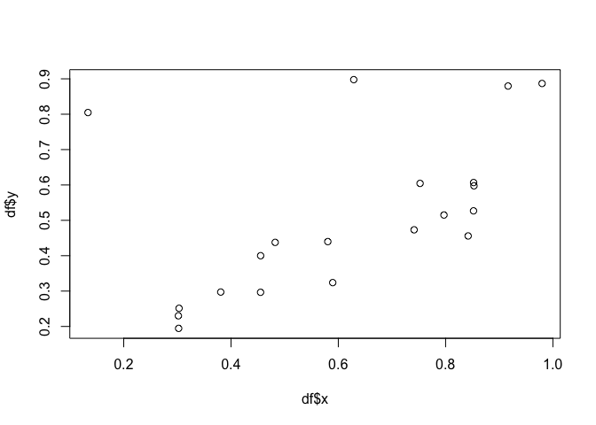

<!-- README.md is generated from README.Rmd. Please edit that file -->

# scatteR

<!-- badges: start -->
<!-- badges: end -->

scatteR generates scatterplots based on
[scagnostic](https://cran.r-project.org/web/packages/scagnostics/index.html)
measurements. The current implementation uses the GenSA package for
optimization.

## Installation

You can install the released version of scatteR from
[Github](https://github.com/janithwanni/scatteR) with:

``` r
install.packages("devtools")
devtools::install_github("janithwanni/scatteR")
```

## Example

``` r
library(scatteR)
## basic example code
df <- scatteR(measurements = c("Monotonic" = 0.9),n_points = 20,
              init_points = 4,error_var = 0.05,global_min = 0.01)
#> [1] "Epoch 1"
#> [1] "Epoch 2"
#> It: 1, obj value: 0.6670302936
#> It: 2, obj value: 0.003634282089
#> [1] "Epoch 3"
#> It: 1, obj value: 0.007071822664
#> [1] "Epoch 4"
#> It: 1, obj value: 0.002205733016
#> [1] "Epoch 5"
#> It: 1, obj value: 4.008685619e-05
```

``` r
library(scagnostics)
scagnostics(df)
#>  Outlying    Skewed    Clumpy    Sparse  Striated    Convex    Skinny   Stringy 
#> 0.3280555 0.7985258 0.3123121 0.3932222 0.1764706 0.2321915 0.5221189 0.4551661 
#> Monotonic 
#> 0.9000401 
#> attr(,"class")
#> [1] "scagnostics"
```

``` r
plot(df$x,df$y)
```


