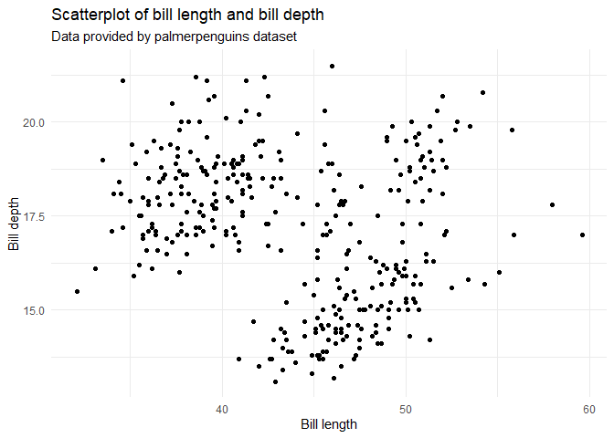
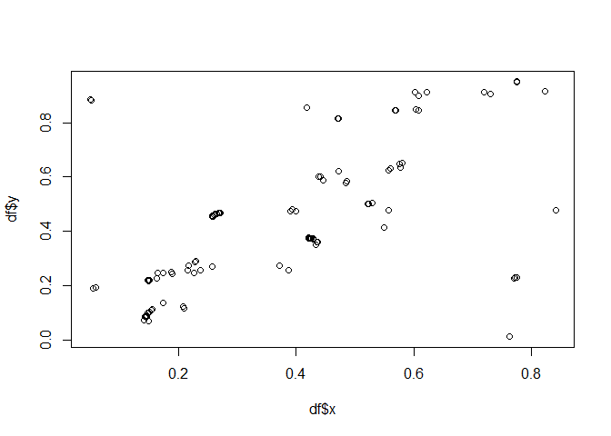
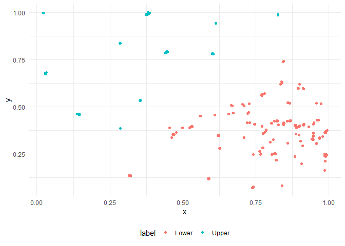
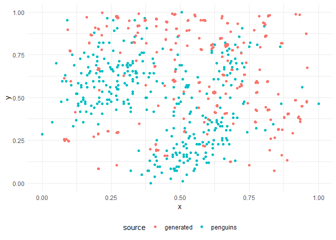

<!-- README.md is generated from README.Rmd. Please edit that file -->

# scatteR

<!-- badges: start -->

<!-- badges: end -->

scatteR generates scatterplots based on
[scagnostic](https://cran.r-project.org/package=scagnostics)
measurements. The current implementation uses Simulated Annealing based
on the GenSA package for optimization and rJava is required for the
scagnostics measurement calculation.

## What are these scagnostics?

Simply put scagnostics are like diagnostics for scatterplots. Each
scatterplot will have a certain set of characteristics that scagnostics
will show to you. You can learn more about it through this
[paper](https://doi.org/10.1109/INFVIS.2005.1532142).

``` r
library(palmerpenguins)
library(scagnostics)
library(ggplot2)
ggplot(aes(x = bill_length_mm,y = bill_depth_mm),data=penguins)+
  geom_point() +
  theme_minimal()+
  labs(x = "Bill length",y = "Bill depth",
       title = "Scatterplot of bill length and bill depth",
       subtitle = "Data provided by palmerpenguins dataset")
```

 The
above scatterplot has the following characteristics according to
scagnostics.

``` r
scagnostics(penguins$bill_length_mm,penguins$bill_depth_mm)
#>   Outlying     Skewed     Clumpy     Sparse   Striated     Convex     Skinny 
#> 0.12472358 0.74153837 0.03680493 0.04861830 0.06785714 0.56068995 0.49944162 
#>    Stringy  Monotonic 
#> 0.37671468 0.06405996 
#> attr(,"class")
#> [1] "scagnostics"
```

## Installation

You can install the released version of scatteR from
[Github](https://github.com/janithwanni/scatteR) with:

``` r
install.packages("devtools")
devtools::install_github("janithwanni/scatteR")
```

## Example

### Simple usage

``` r
library(scatteR)
## basic example code
df <- scatteR(measurements = c("Monotonic" = 0.9),n_points = 100)
#> [1] "Epoch 1"
#> It: 1, obj value (lsEnd): 0.002060606061 indTrace: 1
#> Emini is: 0.002060606061
#> xmini are:
#> 0.6088779565 0.6090173395 0.8227615036 0.3878215198 0.8994341964 0.8448490344 0.9168957344 0.2569016234 
#> Totally it used 1.421 secs
#> No. of function call is: 2375
#> Algorithm reached max number of iterations.
#> [1] "Epoch 2"
#> It: 1, obj value (lsEnd): 0.002382925918 indTrace: 1
#> It: 20, obj value (lsEnd): 0.001763206699 indTrace: 20
#> It: 94, obj value (lsEnd): 0.000693521734 indTrace: 94
#> Have got accurate energy 0.000693521734 <= 0.001 in smooth search
#> Emini is: 0.000693521734
#> xmini are:
#> 0.0546173564 0.1746983563 0.7200118912 0.1420989276 0.1906322498 0.2466444914 0.9137644765 0.07396111759 
#> Totally it used 2.209 secs
#> No. of function call is: 4111
#> [1] "Epoch 3"
#> It: 1, obj value (lsEnd): 0.0009634972381 indTrace: 1
#> Have got accurate energy 0.0009634972381 <= 0.001 in smooth search
#> Emini is: 0.0009634972381
#> xmini are:
#> 0.05923706533 0.216533793 0.7297670833 0.1496266998 0.1945718855 0.2561724492 0.9068899161 0.0698129075 
#> Totally it used 0.49 secs
#> No. of function call is: 887
#> [1] "Epoch 4"
#> It: 1, obj value (lsEnd): 0.001210817323 indTrace: 1
#> Have got accurate energy 0.0001169385438 <= 0.001 in smooth search
#> Emini is: 0.0001169385438
#> xmini are:
#> 0.2267327718 0.2101289746 0.5568445697 0.3941331636 0.2477535754 0.1147347111 0.6246527582 0.4793990233 
#> Totally it used 0.532 secs
#> No. of function call is: 953
#> [1] "Epoch 5"
#> It: 1, obj value (lsEnd): 0.0006452760813 indTrace: 1
#> Have got accurate energy 0.0006452760813 <= 0.001 in smooth search
#> Emini is: 0.0006452760813
#> xmini are:
#> 0.2369021374 0.2075330839 0.5600267842 0.3994985076 0.2557467058 0.122434128 0.631160844 0.4756708313 
#> Totally it used 0.694 secs
#> No. of function call is: 1210
#> [1] "Epoch 6"
#> It: 1, obj value (lsEnd): 0.0002109779468 indTrace: 1
#> Have got accurate energy 0.0002109779468 <= 0.001 in smooth search
#> Emini is: 0.0002109779468
#> xmini are:
#> 0.2569562674 0.1744502052 0.5770949564 0.3897229059 0.2707256099 0.1361316672 0.6357340515 0.4748230489 
#> Totally it used 0.759 secs
#> No. of function call is: 1312
#> [1] "Epoch 7"
#> It: 1, obj value (lsEnd): 4.33048594e-05 indTrace: 1
#> Have got accurate energy 4.33048594e-05 <= 0.001 in smooth search
#> Emini is: 4.33048594e-05
#> xmini are:
#> 0.4185260003 0.6026226855 0.4377566509 0.4418595314 0.8561699531 0.9129988467 0.6026435057 0.6017732116 
#> Totally it used 0.902 secs
#> No. of function call is: 1460
#> [1] "Epoch 8"
#> It: 1, obj value (lsEnd): 2.879774646e-05 indTrace: 1
#> Have got accurate energy 2.879774646e-05 <= 0.001 in smooth search
#> Emini is: 2.879774646e-05
#> xmini are:
#> 0.4717101528 0.6229025185 0.4455721979 0.471719994 0.8154924183 0.9126125016 0.5882155158 0.6197973497 
#> Totally it used 0.659 secs
#> No. of function call is: 999
#> [1] "Epoch 9"
#> It: 1, obj value (lsEnd): 1.78457193e-05 indTrace: 1
#> Have got accurate energy 1.78457193e-05 <= 0.001 in smooth search
#> Emini is: 1.78457193e-05
#> xmini are:
#> 0.7628565626 0.4703925435 0.8410254952 0.3717180485 0.01137133886 0.8150978295 0.4769471629 0.2746651221 
#> Totally it used 0.977 secs
#> No. of function call is: 1352
#> [1] "Epoch 10"
#> It: 1, obj value (lsEnd): 5.342541186e-05 indTrace: 1
#> Have got accurate energy 5.342541186e-05 <= 0.001 in smooth search
#> Emini is: 5.342541186e-05
#> xmini are:
#> 0.7757960575 0.5751214866 0.5493646482 0.05022187138 0.9509835287 0.6482271417 0.4155733754 0.8845937076 
#> Totally it used 0.862 secs
#> No. of function call is: 1221
#> [1] "Epoch 11"
#> It: 1, obj value (lsEnd): 0.0007308666196 indTrace: 1
#> Have got accurate energy 0.0007308666196 <= 0.001 in smooth search
#> Emini is: 0.0007308666196
#> xmini are:
#> 0.7744598373 0.5799802088 0.5570734791 0.05189226154 0.9497962945 0.6515662657 0.4774198794 0.8838005407 
#> Totally it used 0.654 secs
#> No. of function call is: 851
#> [1] "Epoch 12"
#> It: 1, obj value (lsEnd): 0.003797876988 indTrace: 1
#> It: 27, obj value (lsEnd): 0.0001279653614 indTrace: 27
#> Have got accurate energy 0.0001279653614 <= 0.001 in smooth search
#> Emini is: 0.0001279653614
#> xmini are:
#> 0.4238650674 0.1449637363 0.2574165039 0.150969603 0.3748983138 0.08762627991 0.4543316208 0.2201389802 
#> Totally it used 1.375 secs
#> No. of function call is: 2126
#> [1] "Epoch 13"
#> Have got accurate energy 0.0006690638377 <= 0.001 in smooth search
#> Emini is: 0.0006690638377
#> xmini are:
#> 0.4227212424 0.1460237262 0.2573106077 0.148939143 0.3748049992 0.08635129274 0.4557701471 0.2178630906 
#> Totally it used 0 secs
#> No. of function call is: 1
#> [1] "Epoch 14"
#> Have got accurate energy 9.518412714e-05 <= 0.001 in smooth search
#> Emini is: 9.518412714e-05
#> xmini are:
#> 0.4220942115 0.1449279858 0.2589808645 0.1495892111 0.3755523987 0.0851659443 0.4542156899 0.2191293451 
#> Totally it used 0 secs
#> No. of function call is: 1
#> [1] "Epoch 15"
#> Have got accurate energy 0.0002713886758 <= 0.001 in smooth search
#> Emini is: 0.0002713886758
#> xmini are:
#> 0.4217046688 0.1428170319 0.2599530945 0.1484093561 0.3750113687 0.08686813073 0.455160849 0.219669246 
#> Totally it used 0 secs
#> No. of function call is: 1
#> [1] "Epoch 16"
#> It: 1, obj value (lsEnd): 0.0001079452511 indTrace: 1
#> Have got accurate energy 0.0001079452511 <= 0.001 in smooth search
#> Emini is: 0.0001079452511
#> xmini are:
#> 0.4293161386 0.1470570705 0.2609946465 0.1632151344 0.3710028186 0.08950931574 0.4618439674 0.2278187092 
#> Totally it used 0.703 secs
#> No. of function call is: 986
#> [1] "Epoch 17"
#> It: 1, obj value (lsEnd): 0.0001488984651 indTrace: 1
#> Have got accurate energy 0.0001488984651 <= 0.001 in smooth search
#> Emini is: 0.0001488984651
#> xmini are:
#> 0.4291565003 0.147880514 0.2619049054 0.1644920502 0.3728763925 0.1007537088 0.4630871203 0.248153702 
#> Totally it used 0.693 secs
#> No. of function call is: 960
#> [1] "Epoch 18"
#> It: 1, obj value (lsEnd): 3.746684033e-05 indTrace: 1
#> Have got accurate energy 3.746684033e-05 <= 0.001 in smooth search
#> Emini is: 3.746684033e-05
#> xmini are:
#> 0.429080031 0.1486846417 0.2627806584 0.1874050642 0.3734030104 0.1010832144 0.4628354626 0.2484904641 
#> Totally it used 0.635 secs
#> No. of function call is: 880
#> [1] "Epoch 19"
#> It: 1, obj value (lsEnd): 4.910409006e-05 indTrace: 1
#> Have got accurate energy 4.910409006e-05 <= 0.001 in smooth search
#> Emini is: 4.910409006e-05
#> xmini are:
#> 0.4260382697 0.1506449063 0.2651612944 0.1891318697 0.3728316213 0.1024079953 0.4629696596 0.2440548646 
#> Totally it used 0.513 secs
#> No. of function call is: 690
#> [1] "Epoch 20"
#> It: 1, obj value (lsEnd): 5.739727661e-06 indTrace: 1
#> Have got accurate energy 5.739727661e-06 <= 0.001 in smooth search
#> Emini is: 5.739727661e-06
#> xmini are:
#> 0.4336521126 0.154754922 0.269143302 0.2170821089 0.351734218 0.1091373996 0.4665831349 0.274463175 
#> Totally it used 0.745 secs
#> No. of function call is: 992
#> [1] "Epoch 21"
#> It: 1, obj value (lsEnd): 2.171413779e-05 indTrace: 1
#> Have got accurate energy 2.171413779e-05 <= 0.001 in smooth search
#> Emini is: 2.171413779e-05
#> xmini are:
#> 0.4360398912 0.1550753487 0.2715610113 0.2275991116 0.3613095525 0.1112710751 0.4680113249 0.2881290187 
#> Totally it used 0.671 secs
#> No. of function call is: 886
#> [1] "Epoch 22"
#> Have got accurate energy 0.0009122849232 <= 0.001 in smooth search
#> Emini is: 0.0009122849232
#> xmini are:
#> 0.4373143974 0.1563527967 0.2705337907 0.2294159278 0.3602169693 0.1114748047 0.4682397037 0.2893593581 
#> Totally it used 0 secs
#> No. of function call is: 1
#> [1] "Epoch 23"
#> It: 1, obj value (lsEnd): 0.002067656372 indTrace: 1
#> It: 10, obj value (lsEnd): 6.65756155e-06 indTrace: 10
#> Have got accurate energy 6.65756155e-06 <= 0.001 in smooth search
#> Emini is: 6.65756155e-06
#> xmini are:
#> 0.5689789743 0.522415245 0.4842973922 0.7746003067 0.8457083237 0.5020269089 0.5763101124 0.2294790529 
#> Totally it used 1.322 secs
#> No. of function call is: 1690
#> [1] "Epoch 24"
#> Have got accurate energy 0.0001435990494 <= 0.001 in smooth search
#> Emini is: 0.0001435990494
#> xmini are:
#> 0.5674822023 0.5230691084 0.485333642 0.7715581937 0.8468891419 0.5012439822 0.5778691297 0.2289942033 
#> Totally it used 0 secs
#> No. of function call is: 1
#> [1] "Epoch 25"
#> It: 1, obj value (lsEnd): 2.006914323e-05 indTrace: 1
#> Have got accurate energy 2.006914323e-05 <= 0.001 in smooth search
#> Emini is: 2.006914323e-05
#> xmini are:
#> 0.6030009731 0.529136175 0.4870028142 0.7711446692 0.8499393003 0.5032072806 0.5839952851 0.2252596066 
#> Totally it used 0.649 secs
#> No. of function call is: 822
```

``` r
scagnostics(df)
#>  Outlying    Skewed    Clumpy    Sparse  Striated    Convex    Skinny   Stringy 
#> 0.3374091 0.8469671 0.2213065 0.1606455 0.1296296 0.2339855 0.6467435 0.4519979 
#> Monotonic 
#> 0.8999799 
#> attr(,"class")
#> [1] "scagnostics"
```

``` r
plot(df$x,df$y)
```



### Integration into the tidy workflow

``` r
library(tidyverse)
scatteR(c("Convex" = 0.9),n_points = 250,verbose=FALSE) %>% # data generation
  mutate(label = ifelse(y > x,"Upper","Lower")) %>% # data preprocessing
  ggplot(aes(x = x,y = y,color=label))+
  geom_point()+
  theme_minimal()+
  theme(legend.position = "bottom")
```



### Using scagnostics output to generate data

``` r
generated <- scatteR(scagnostics(penguins$bill_length_mm,
                                 penguins$bill_depth_mm),
        n_points = length(penguins$bill_length_mm),verbose=FALSE)
penguins %>% 
  select(bill_length_mm,bill_depth_mm) %>% 
  drop_na() %>% 
  rename(x = bill_length_mm,y = bill_depth_mm) %>% 
  mutate(x = (x - min(x)) / (max(x) - min(x)),
         y = (y - min(y)) / (max(y) - min(y)),
         source = "penguins") %>% 
  bind_rows(generated %>% mutate(source = "generated")) %>% 
ggplot(aes(x = x,y = y,color=source))+
  geom_point()+
  theme_minimal()+
  theme(legend.position = "bottom")
```


