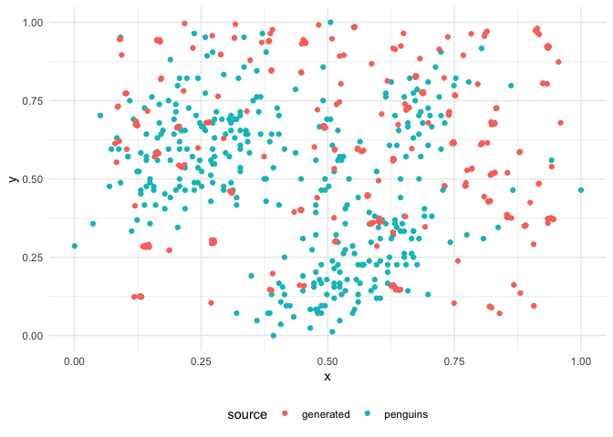

<!-- README.md is generated from README.Rmd. Please edit that file -->

# scatteR

<!-- badges: start -->
<!-- badges: end -->

scatteR generates scatterplots based on
[scagnostic](https://cran.r-project.org/package=scagnostics)
measurements. The current implementation uses Simulated Annealing based
on the GenSA package for optimization and rJava is required for the
scagnostics measurement calculation.

## What are these scagnostics?

Simply put scagnostics are like diagnostics for scatterplots. Each
scatterplot will have a certain set of characteristics that scagnostics
will show to you. You can learn more about it through this
[paper](https://doi.org/10.1109/INFVIS.2005.1532142).

``` r
library(palmerpenguins)
library(scagnostics)
library(ggplot2)
qplot(x = bill_length_mm,y = bill_depth_mm,data=penguins)+
  theme_minimal()+
  labs(x = "Bill length",y = "Bill depth",
       title = "Scatterplot of bill length and bill depth",
       subtitle = "Data provided by palmerpenguins dataset")
```

 The
above scatterplot has the following characteristics according to
scagnostics.

``` r
scagnostics(penguins$bill_length_mm,penguins$bill_depth_mm)
#>   Outlying     Skewed     Clumpy     Sparse   Striated     Convex     Skinny 
#> 0.12472358 0.74153837 0.03680493 0.04861830 0.06785714 0.56068995 0.49944162 
#>    Stringy  Monotonic 
#> 0.37671468 0.06405996 
#> attr(,"class")
#> [1] "scagnostics"
```

## Installation

You can install the released version of scatteR from
[Github](https://github.com/janithwanni/scatteR) with:

``` r
install.packages("devtools")
devtools::install_github("janithwanni/scatteR")
```

## Example

### Simple usage

``` r
library(scatteR)
## basic example code
df <- scatteR(measurements = c("Monotonic" = 0.9),n_points = 100)
#> [1] "Epoch 1"
#> It: 1, obj value: 0.002060606061
#> [1] "Epoch 2"
#> It: 1, obj value: 0.002382925918
#> It: 20, obj value: 0.001763206699
#> It: 94, obj value: 0.000693521734
#> [1] "Epoch 3"
#> It: 1, obj value: 0.0009634972381
#> [1] "Epoch 4"
#> It: 1, obj value: 0.001210817323
#> [1] "Epoch 5"
#> It: 1, obj value: 0.0006452760813
#> [1] "Epoch 6"
#> It: 1, obj value: 0.0002109779468
#> [1] "Epoch 7"
#> It: 1, obj value: 4.33048594e-05
#> [1] "Epoch 8"
#> It: 1, obj value: 2.879774646e-05
#> [1] "Epoch 9"
#> It: 1, obj value: 1.78457193e-05
#> [1] "Epoch 10"
#> It: 1, obj value: 5.342541186e-05
#> [1] "Epoch 11"
#> It: 1, obj value: 0.0007308666196
#> [1] "Epoch 12"
#> It: 1, obj value: 0.003797876988
#> It: 27, obj value: 0.0001279653614
#> [1] "Epoch 13"
#> [1] "Epoch 14"
#> [1] "Epoch 15"
#> [1] "Epoch 16"
#> It: 1, obj value: 0.0001079452511
#> [1] "Epoch 17"
#> It: 1, obj value: 0.0001488984651
#> [1] "Epoch 18"
#> It: 1, obj value: 3.746684033e-05
#> [1] "Epoch 19"
#> It: 1, obj value: 4.910409006e-05
#> [1] "Epoch 20"
#> It: 1, obj value: 5.739727661e-06
#> [1] "Epoch 21"
#> It: 1, obj value: 2.171413779e-05
#> [1] "Epoch 22"
#> [1] "Epoch 23"
#> It: 1, obj value: 0.002067656372
#> It: 10, obj value: 6.65756155e-06
#> [1] "Epoch 24"
#> [1] "Epoch 25"
#> It: 1, obj value: 2.006914323e-05
```

``` r
scagnostics(df)
#>  Outlying    Skewed    Clumpy    Sparse  Striated    Convex    Skinny   Stringy 
#> 0.3374091 0.8469671 0.2213065 0.1606455 0.1296296 0.2339855 0.6467435 0.4519979 
#> Monotonic 
#> 0.8999799 
#> attr(,"class")
#> [1] "scagnostics"
```

``` r
plot(df$x,df$y)
```


### Integration into the tidy workflow

``` r
library(tidyverse)
scatteR(c("Convex" = 0.9),n_points = 250,verbose=FALSE) %>% # data generation
  mutate(label = ifelse(y > x,"Upper","Lower")) %>% # data preprocessing
  ggplot(aes(x = x,y = y,color=label))+
  geom_point()+
  theme_minimal()+
  theme(legend.position = "bottom")
```


### Using scagnostics output to generate data

``` r
generated <- scatteR(scagnostics(penguins$bill_length_mm,
                                 penguins$bill_depth_mm),
        n_points = length(penguins$bill_length_mm),verbose=FALSE)
penguins %>% 
  select(bill_length_mm,bill_depth_mm) %>% 
  drop_na() %>% 
  rename(x = bill_length_mm,y = bill_depth_mm) %>% 
  mutate(x = (x - min(x)) / (max(x) - min(x)),
         y = (y - min(y)) / (max(y) - min(y)),
         source = "penguins") %>% 
  bind_rows(generated %>% mutate(source = "generated")) %>% 
ggplot(aes(x = x,y = y,color=source))+
  geom_point()+
  theme_minimal()+
  theme(legend.position = "bottom")
```


