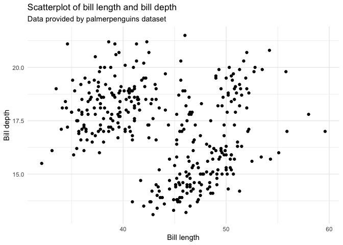
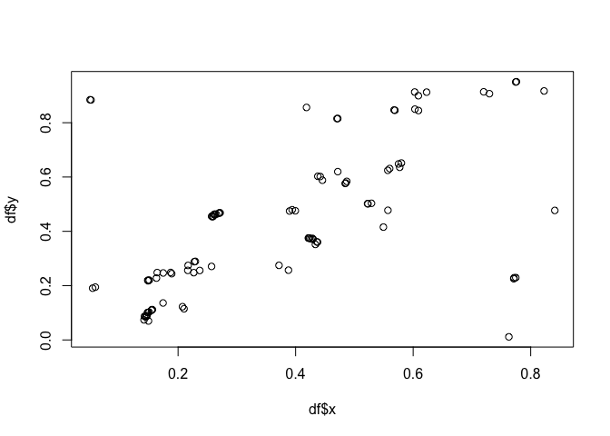

<!-- README.md is generated from README.Rmd. Please edit that file -->

# scatteR

<!-- badges: start -->
<!-- badges: end -->

scatteR generates scatterplots based on
[scagnostic](https://cran.r-project.org/web/packages/scagnostics/index.html)
measurements. The current implementation uses Simulated Annealing based
on the GenSA package for optimization and rJava is required for the
scagnostics measurement calculation.

## What are these scagnostics?

Simply put scagnostics are like diagnostics for scatterplots. Each
scatterplot will have a certain set of characteristics that scagnostics
will show to you. You can learn more about it through this
[paper](https://www.semanticscholar.org/paper/Graph-theoretic-scagnostics-Wilkinson-Anand/8bc9868fe6c936614f7f94b01757723e9ffaaa43).

``` r
library(palmerpenguins)
library(scagnostics)
plot(penguins$bill_length_mm,penguins$bill_depth_mm)
```

 The
above scatterplot has the following characteristics according to
scagnostics.

``` r
scagnostics(penguins$bill_length_mm,penguins$bill_depth_mm)
#>   Outlying     Skewed     Clumpy     Sparse   Striated     Convex     Skinny 
#> 0.12472358 0.74153837 0.03680493 0.04861830 0.06785714 0.56068995 0.49944162 
#>    Stringy  Monotonic 
#> 0.37671468 0.06405996 
#> attr(,"class")
#> [1] "scagnostics"
```

## Installation

You can install the released version of scatteR from
[Github](https://github.com/janithwanni/scatteR) with:

``` r
install.packages("devtools")
devtools::install_github("janithwanni/scatteR")
```

## Example

### Simple usage

``` r
library(scatteR)
## basic example code
df <- scatteR(measurements = c("Monotonic" = 0.9),n_points = 100)
#> [1] "Epoch 1"
#> It: 1, obj value: 0.06908920274
#> [1] "Epoch 2"
#> It: 1, obj value: 0.02826137844
#> It: 47, obj value: 0.001234673525
#> [1] "Epoch 3"
#> It: 1, obj value: 0.0003086341952
#> [1] "Epoch 4"
#> It: 1, obj value: 0.0001684042791
#> [1] "Epoch 5"
#> [1] "Epoch 6"
#> It: 1, obj value: 4.731619094e-05
#> [1] "Epoch 7"
#> It: 1, obj value: 6.463110673e-05
#> [1] "Epoch 8"
#> It: 1, obj value: 0.0005844103336
#> [1] "Epoch 9"
#> It: 1, obj value: 2.90872382e-05
#> [1] "Epoch 10"
#> It: 1, obj value: 1.092022236e-05
#> [1] "Epoch 11"
#> It: 1, obj value: 4.10444138e-05
#> [1] "Epoch 12"
#> It: 1, obj value: 2.63737808e-06
#> [1] "Epoch 13"
#> It: 1, obj value: 9.462761899e-05
#> [1] "Epoch 14"
#> It: 1, obj value: 6.843463089e-06
#> [1] "Epoch 15"
#> It: 1, obj value: 3.937853737e-06
#> [1] "Epoch 16"
#> It: 1, obj value: 0.005547845654
#> It: 8, obj value: 1.647764738e-06
#> [1] "Epoch 17"
#> It: 1, obj value: 7.81726338e-06
#> [1] "Epoch 18"
#> It: 1, obj value: 2.918974143e-06
#> [1] "Epoch 19"
#> It: 1, obj value: 3.764917101e-05
#> [1] "Epoch 20"
#> It: 1, obj value: 1.067942567e-05
```

``` r
scagnostics(df)
#>  Outlying    Skewed    Clumpy    Sparse  Striated    Convex    Skinny   Stringy 
#> 0.2538847 0.8248022 0.1018009 0.1291258 0.1967213 0.4598955 0.6536334 0.4664043 
#> Monotonic 
#> 0.9000107 
#> attr(,"class")
#> [1] "scagnostics"
```

``` r
plot(df$x,df$y)
```



### Integration into the tidy workflow

``` r
library(tidyverse)
scatteR(c("Convex" = 0.9),n_points = 250,verbose=FALSE) %>% # data generation
  mutate(label = ifelse(y > x,"Upper","Lower")) %>% # data preprocessing
  ggplot(aes(x = x,y = y,color=label))+
  geom_point()+
  theme_minimal()+
  theme(legend.position = "bottom")
```


### Using scagnostics output to generate data

``` r
generated <- scatteR(scagnostics(penguins$bill_length_mm,
                                 penguins$bill_depth_mm),
        n_points = length(penguins$bill_length_mm),verbose=FALSE)
penguins %>% 
  select(bill_length_mm,bill_depth_mm) %>% 
  drop_na() %>% 
  rename(x = bill_length_mm,y = bill_depth_mm) %>% 
  mutate(x = (x - min(x)) / (max(x) - min(x)),
         y = (y - min(y)) / (max(y) - min(y)),
         source = "penguins") %>% 
  bind_rows(generated %>% mutate(source = "generated")) %>% 
ggplot(aes(x = x,y = y,color=source))+
  geom_point()+
  theme_minimal()+
  theme(legend.position = "bottom")
```


